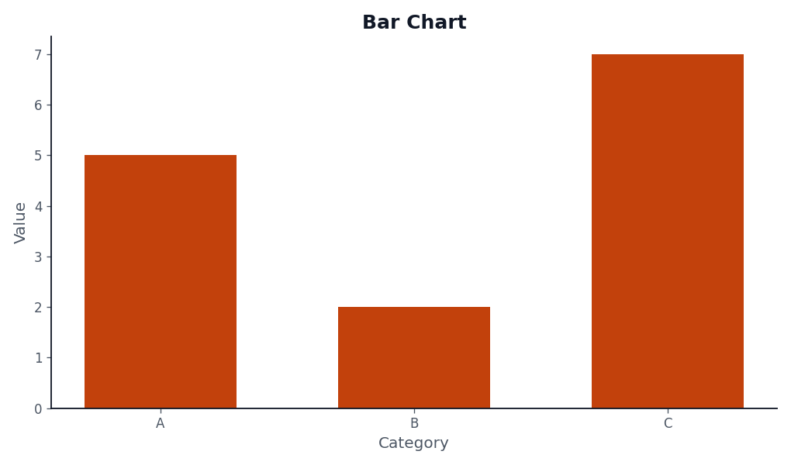
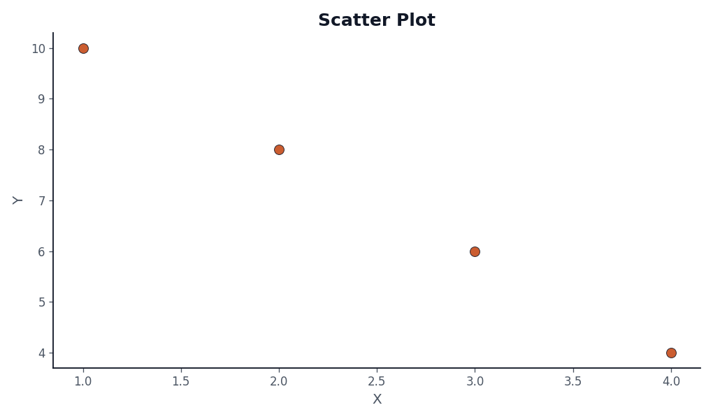
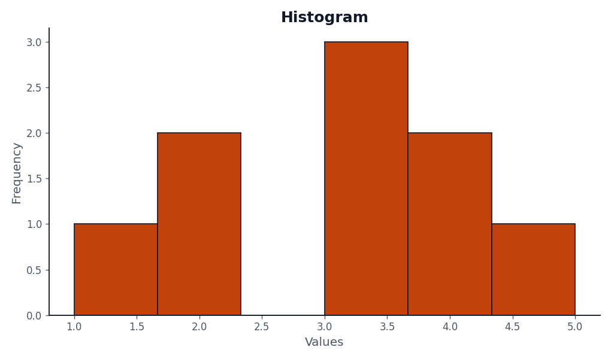
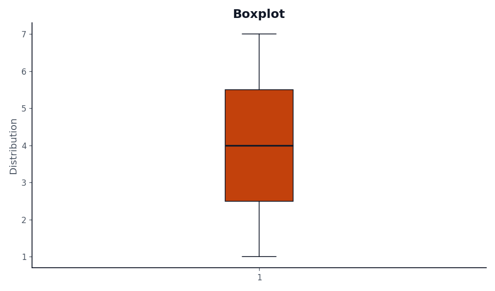
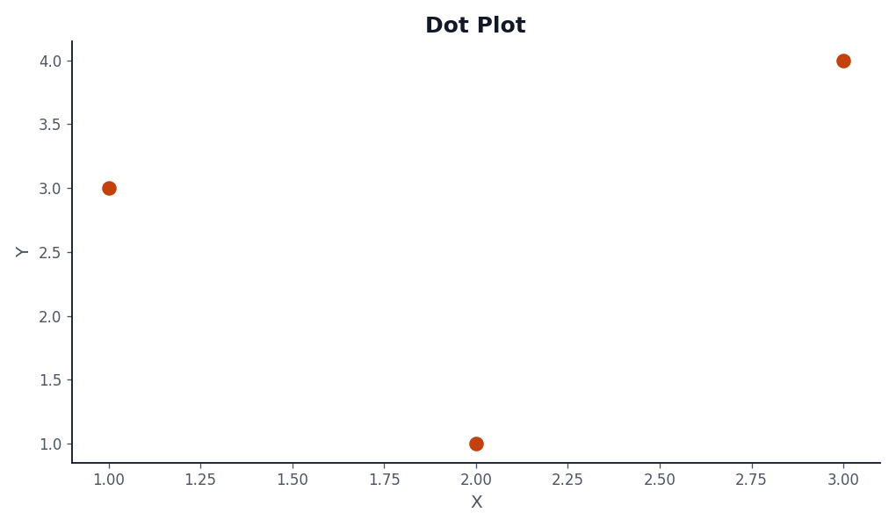

# Quiz1-storytelling

## 1. Project Overview

VizStyle Bouchra is a personal Python visualization library developed as part of Quiz 1 : Storytelling & Data Visualization.
The objective of this project is to design a reusable, pip-installable visualization library that provides clean, professional, and consistent graphical styles, inspired by editorial and consulting-grade data visualization standards.

The library intentionally avoids default Matplotlib aesthetics and common data-science color conventions (blue/green), focusing instead on clarity, minimalism, and visual consistency.

## 2. Design Principles

The visual design of the library follows strict principles:

No grid lines (to reduce visual noise)

No line plots (to avoid misleading trends in static analysis)

A single accent color, defined centrally

Neutral background and typography

High readability in reports (PDF, slides, print)

All colors are centralized in a single palette to enforce consistency across all plots.

## 3. Implemented Visualizations

The library provides five different visualization functions, meeting the minimum requirement of the assignment:

Function Name	Visualization Type
styled_bar	Bar chart
styled_scatter	Scatter plot
styled_dot	Dot plot
styled_hist	Histogram
styled_boxplot	Boxplot

## 4. Example Usage

import vizstyle_bouchra as vz

vz.styled_bar(
    x=["A", "B", "C"],
    y=[5, 2, 7],
    title="Bar Chart",
    xlabel="Category",
    ylabel="Value"
)

vz.styled_scatter(
    x=[1, 2, 3, 4],
    y=[10, 8, 6, 4],
    title="Scatter Plot",
    xlabel="X",
    ylabel="Y"
)

vz.styled_hist(
    data=[1, 2, 2, 3, 3, 3, 4, 4, 5],
    title="Histogram",
    xlabel="Values"
)

vz.styled_boxplot(
    data=[1, 2, 3, 4, 5, 6, 7],
    title="Boxplot",
    ylabel="Distribution"
)

vz.styled_dot(
    x=[1, 2, 3],
    y=[3, 1, 4],
    title="Dot Plot",
    xlabel="X",
    ylabel="Y"
)

## 5. Installation Instructions

To install the library locally:

pip install -e .


The project uses pyproject.toml and follows PEP 517 standards for packaging.

## 6. Graphical Outputs

### Bar Chart


### Scatter Plot


### Histogram


### Boxplot


### Dot Plot


# VizStyle Bouchra – Election Data Storytelling

A Python visualization library developed for the Data Storytelling assignment.
It provides reusable, styled charts and interactive maps using Bokeh and Matplotlib.

## Objectives

- Apply data storytelling best practices
- Visualize election results at ADM2 (moughataa) level
- Avoid misleading graphics (single scale, perceptual colormap)
- Provide reusable and well-documented plotting functions

## Technologies

- Python 3.10+
- Pandas, GeoPandas
- Bokeh (interactive maps)
- Custemized biblio

- ## Usage

### Election map with candidate selector

```python
import vizstyle_bouchra as vz

vz.styled_election_map_bokeh(
    csv_url="https://raw.githubusercontent.com/binorassocies/rimdata/refs/heads/main/data/results_elections_rim_2019-2024.csv",
    shp_path="mrshape/mrt_admbnda_adm2_ansade_20240327.shp"
)


